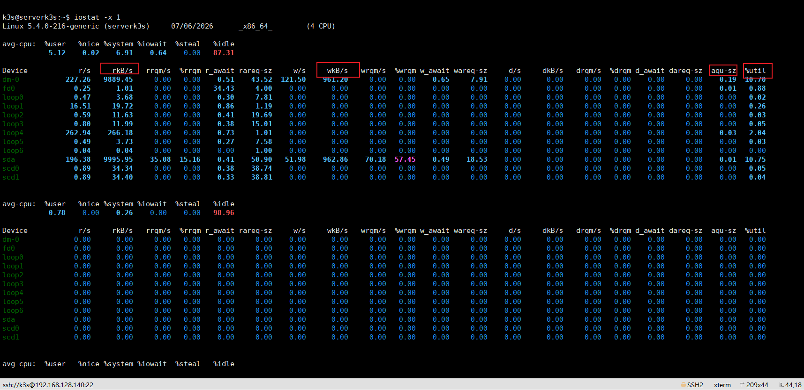

## **前提需知**

- **误区纠正**：SSD/NVM1 磁盘利用率达 100% 不代表性能耗尽，仅说明磁盘处于工作状态，仍可承接更高并发。
- **核心指标解读**：iostat -x 的 await 指标反映 IO 请求平均等待时间，几毫秒为健康状态，飙升至几十到上百毫秒则说明磁盘卡顿；请求队列长度持续居高不下，代表 IO 请求出现拥堵。

## **链路分析**

- 用 iostat -x 每秒刷新查看 await 和请求队列长度，确认存在 IO 瓶颈后，再用 pidstat -d 锁定高频读写的业务进程。这套从指标判断到进程定位的闭环逻辑，才是磁盘 IO 报警排查的完整路径。重点盯住 

  

  **`aqu-sz`（队列）** 和 **`%util`（繁忙度）** 以及 **`await`（响应延迟）**

  

  

## **排查逻辑**

1.先使用iostat -x进行排查有无io瓶颈

